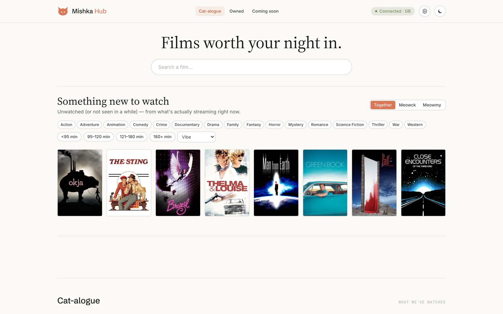
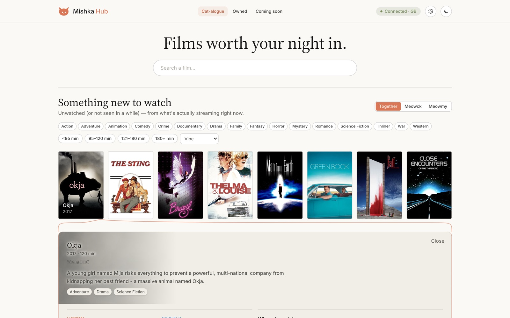
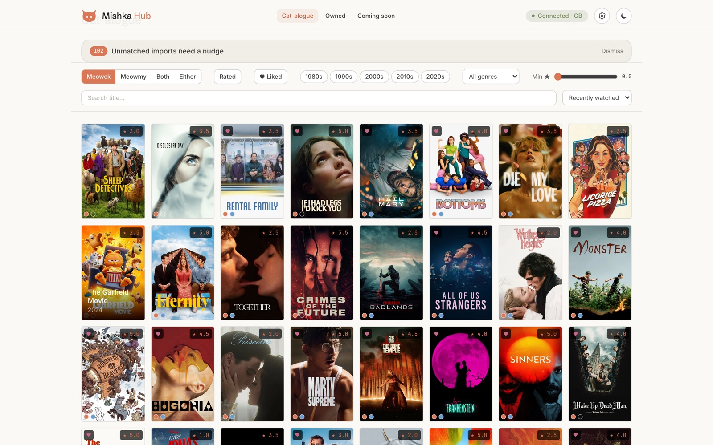
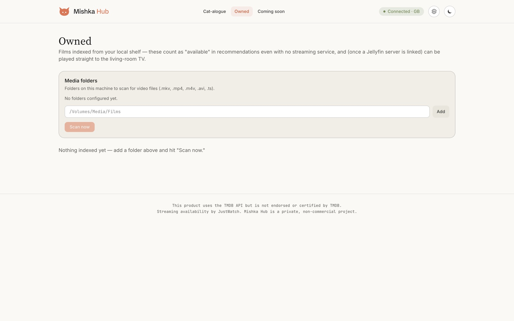
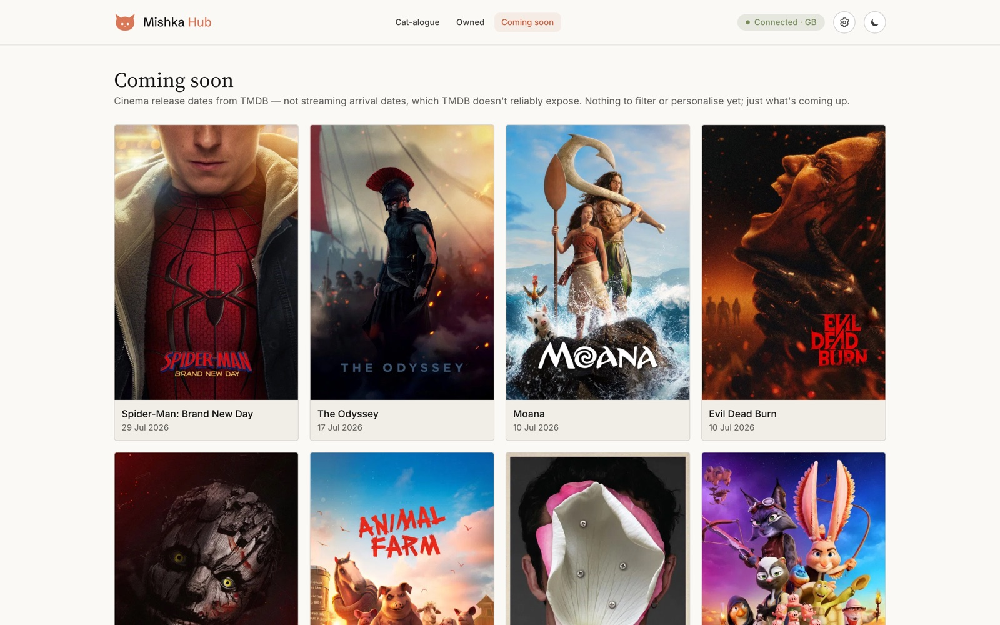
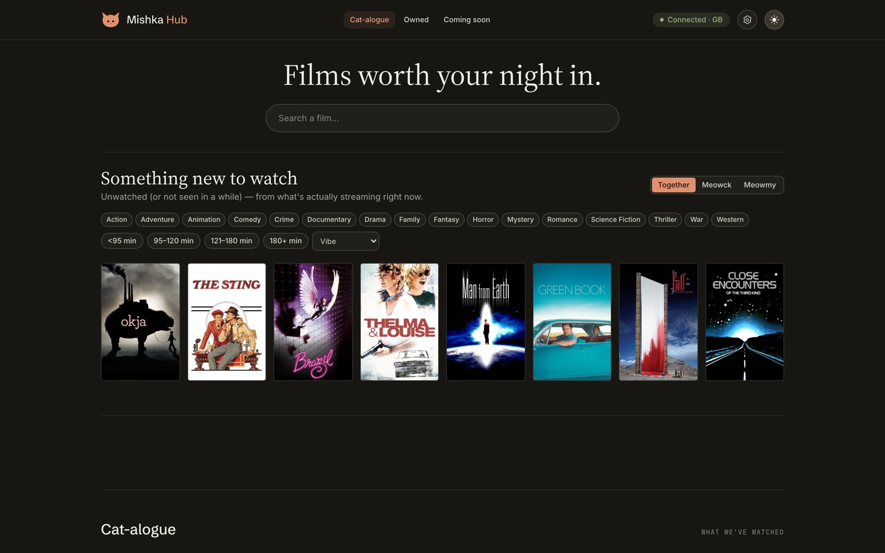

# 🐾 Mishka Hub

*Two people, one cat-shaped household, and a nightly argument about what to watch — solved with
actual machine learning instead of "idk, you pick."*

Mishka Hub is a private movie night concierge, built for exactly two people (Luminal/"Meowck"
and Garfield/"Meowmy" — yes, the whole app is cat-themed, no we will not be taking questions
about this). It knows what you've both already seen, what you're actually paying to stream, and
uses a real recommender model — not a chatbot — to work out what's worth watching *tonight*.



## What it's actually for

Every streaming service has a recommendation engine. None of them know that *you two specifically*
have already watched half their "recommended for you" row, that one of you rates everything a
full star higher than the other, or that a chunk of your history is logged for one person and not
the other. Mishka Hub exists because that context is the whole problem, and no one-size-fits-all
algorithm has it.

So it does one thing well: given both your real histories and your real subscriptions, rank the
films you *haven't* seen (or haven't seen in a year) by how likely you are to actually enjoy them
tonight — together, or solo.

## The tour

**Something new to watch.** The homepage row: unwatched-or-stale picks, filterable by genre,
runtime, and "vibe" (slow burn, feel good, tense, dark...), scoped to Meowck, Meowmy, or both of
you. Click a poster and it expands right there — no page navigation — with a little curly-brace
line connecting the card to its detail panel, because we thought that was neat.



**The Cat-alogue.** A dense, Letterboxd-style poster wall of everything either of you has ever
logged, with your own ratings, likes, and rewatch history baked right into each poster.



**Owned.** Got physical media, or a personal media server? Point Mishka Hub at the folder, hit
scan, and matched films count as "available" for recommendations even when nothing's streaming
them — because you already own the thing.



**Coming soon.** What's about to hit cinemas, so you can plan the actual date-night-out instead
of just the night-in.



**Dark mode**, because it's a movie app and someone's always watching it with the lights off.



## How the pieces actually talk to each other

```
  Letterboxd (CSV export / RSS)  ──▶  FastAPI importer  ──▶  SQLite (films, watches,
                                            │                  ratings, likes)
                                            ▼
  TMDB API (metadata, posters,  ◀── hydration on demand ──▶  Recommender
  UK watch providers, JustWatch)                              (scikit-learn: per-user
                                            ▲                  taste model + content
                                            │                  similarity + MMR diversity)
                                            │
                       React SPA  ◀── REST/JSON, bearer token ──┘
                    (this is what you click on)
```

- **Getting your history in:** Letterboxd's own API refuses recommendation-engine use cases (we
  checked), so imports run a fallback cascade instead — an automated full data export, a
  public-profile scrape as backup, RSS polling for day-to-day freshness, and "just tap watched in
  the app" as the always-available floor. Anything that can't be confidently matched to a TMDB
  film lands in a manual-resolution queue rather than getting silently guessed at.
- **Turning that into recommendations:** every film gets a feature vector from TMDB (genre,
  cast, keywords, decade, runtime...). Each person's ratings fit a Ridge regression blended with
  a "taste prototype" vector, so the model works from day one (cold start) and gets sharper as
  you rate more. Scores get diversity-reranked (MMR) so you don't just get eight versions of the
  same film, then filtered hard: **not already seen (or not seen in ≥365 days) AND actually
  available on something you pay for.** Owned local films count as "available" too.
- **Where to watch:** TMDB's `/watch/providers` (backed by JustWatch) tells us who has what in
  the UK; a Settings page lets you tell it which services you actually subscribe to, so
  recommendations never suggest something you'd need a different service to watch.
- **The frontend** is a static React build that talks to the backend over plain REST with a
  bearer token — no server-side rendering, no session cookies, just fetch calls.

None of this is generative AI. It's classical, inspectable ML — every recommendation comes with
a score breakdown (`/why`) showing exactly which signal pushed it up.

See [docs/PLAN.md](docs/PLAN.md) for the full roadmap and documentation index — the deep-dive
docs live in [docs/](docs/): [architecture](docs/ARCHITECTURE.md), [data
model](docs/DATA_MODEL.md), [API reference](docs/API.md), [design
system](docs/DESIGN.md), [deployment](docs/DEPLOYMENT.md), and one implementation plan per build
phase in [docs/phases/](docs/phases/) — each kept honest about what actually shipped versus
what's deliberately scoped down or still ahead.

## Run it locally

1. **Backend** (one-time): see [apps/server/README.md](apps/server/README.md) to create the
   venv, install deps, and paste a free [TMDB key](https://www.themoviedb.org/settings/api)
   into `apps/server/.env`.
2. **Both servers together:**
   ```bash
   chmod +x scripts/dev.sh   # first time only
   scripts/dev.sh            # backend :8000 + web :5173, Ctrl-C stops both
   ```
3. Open http://127.0.0.1:5173

This is a household tool, not a public product — exactly two accounts exist (Meowck and Meowmy),
there is no registration path anywhere in the codebase, and the database holds two real people's
real watch history. `data/`, `backups/`, `reference/`, and every `.env` are gitignored on
purpose. First-time setup needs one more step: set both passwords with
`python apps/server/scripts/set_password.py <email>` (hidden prompt, run locally — never typed
into a form or sent anywhere else).

## Status

Well past the original scaffold. Shipped and verified against the real household data: Letterboxd
import, the Cat-alogue, in-app rating/watch editing, real streaming availability, the
personalised recommender, an owned-media tab with local-file matching, an upcoming-releases tab,
real two-person login (JWT + argon2id, no registration surface), dark mode, and a full mobile
pass. See [docs/PLAN.md](docs/PLAN.md) and [docs/phases/](docs/phases/) for exactly what's done
versus still ahead — Letterboxd write-back, streaming-arrival ("coming to Netflix") dates, and
Jellyfin "Play on TV" (built, not yet tested against a live server) are the main things left.
